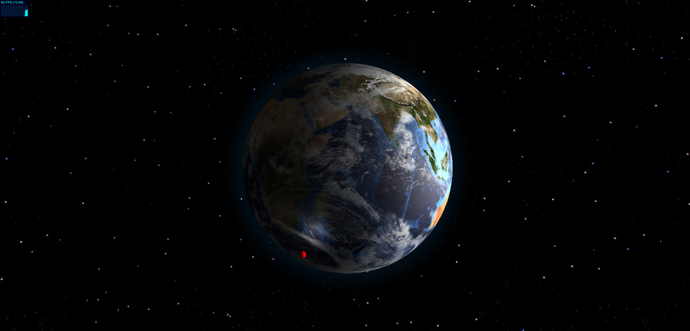

<h1 style="text-align: center;">ISS Position</h1>

A 3D model of the ISS's position around the earth.

<h3>Description</h3>

Displays a 3D model of the ISS orbiting around the earth.

To do:

<ul>
  <li>Create the ISS model in Blender.</li>
  <li>Get real time ISS coordinates.</li>
  <li>Send real time data to the program and adjust ISS model accordingly.</li>
  <li>If the program loads quickly, increase quality of Earth model.</li>
</ul>

Try out a demo <a href="http://www.bryanjones.us/ISS">here</a>.

